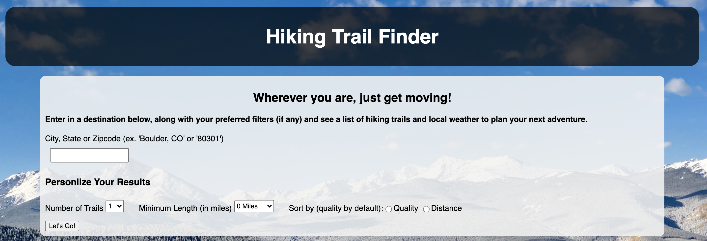

# Hiking API Capstone

## Live link
Check out a live working version of my web app [here]https://alex-mccaffrey.github.io/hiking-api-project/index.html).

## Summary
I created Tectonic MVMT to provide a clean and simple way for users to quickly gather hiking trails options in their area. There are some basic filters that allow the user to declare a maximum number of results, the miniumum length of the hike, and how to sort the hikes. In addition to this, current and future weather conditions are provided so the user can plan accordingly. The final feature is the map, where users can click on the coordinates for a certain trail and get a precise marker on the map for reference.

## Welcome Page
It all starts with a simple interfance where the user can input a location and apply any desired filters.

## Trail Results
Once a user submits the information provided above, a list of trails is displayed. Each trails includes the name, a brief summary, the trail rating, a small picture, a link for more information, and the corridinates that allow you to display a marker on the map below.

## Weather Conditions
Weather conditions are provided at the same time as the trail results with no extra input from the user. This provides the current conditions, tempurture and wind, along with a tomorrow's forecast to allow for adequate planning. The weather condition icon is also displayed in the header for quick reference.

## Map
The map is provided as a reference in case the user is not familiar with the trail location. Within each trail results is a button with the coordinates for that specific trail. Once clicked, a marker is placed on the map allowing the user to see the exact location of the trail head.

## Technology Used
For this project, I utilized everything I have learned thus far in the curriculum. This includes, HTML, CSS, Javascript, jQuery, and API's.
